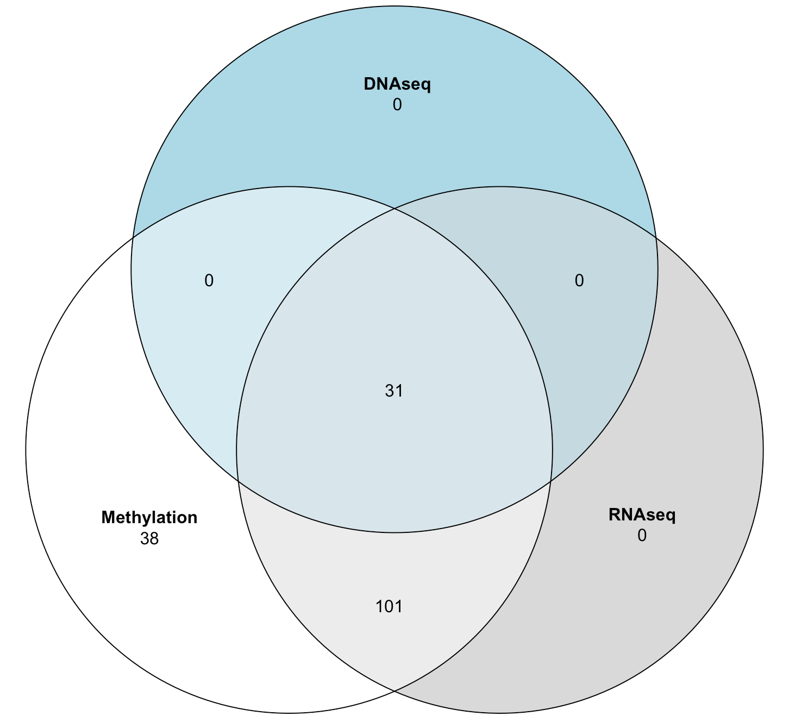

# Follicular Lymphoma Multiomics Project (FLOMICS) - integrating data from targeted DNA sequencing, methylome profiling, bulk RNAseq and single nuclei RNAseq to discover new subtypes 

Molecular classification or subtyping of cancers is becoming an essential step toward clinical practice of precision medicine. In follicular lymphoma (FL), molecular classification or subtyping has emerged as a major unmet need. This project focuses on the analysis of multi-omics data to subclassify FL. The project aims to study gene mutations, the transcriptome and the methylome of FL, to rigorously define and validate molecular subtypes by unravelling inter- and intra-patient heterogeneity. Our hypothesis is that FL is not just one disease, but that it can be classified into biologically distinct subgroups.

## Pilot Study

In November, 2018, data for 30 patients with advanced-stage FL, 17 of those who had early-progression and 13 who had late-no-progression were received from Ontario Institute for Cancer Research (OICR).  The samples were originally obtained from Centre for Lymphoid Cancer at British Columbia Cancer Agency (BCCA) and data were extracted from formalin-fixed paraffin-embedded (FFPE) samples. RNA sequencing and DNA methylation seq data were available for these 30 patients. See the [link](https://github.com/anjalisilva/FLOMICS) for pilot study scripts. 

## Expanded Study

Currently, the project is in the process of receving more samples. All samples are shown below, as of 21 July 2020:

Used samples are shown below, as of 21 July 2020:

### Methylome: DNA methylation EPIC Microarray Data Analysis

In February 2019, DNA methylation data for another 147 patients using Illumina MethylationEpic BeadChip were received. The breakdown of these samples were as follows:
- 10 diffuse large B-cell lymphoma (DLBCL) = “aggressive” control
- 5 reactive lymph node (RLN) = “normal” control
- 132 FL = cases
With the 30 FL samples from pilot dataset, a total of 177 samples and 162 FL cases. Of these, only 170 were used for downstream analysis based on QC. Copy number data was derived for 165 of these samples (170 - 5 RLN “normal” controls). 

#### Main Scripts

- Preprocessing/QC [[Code]](https://github.com/kridel-lab/FLOMICS/blob/master/Code/Analysis/Methylation/1_QCRemoveSamples.R)
- Differential methylation via probes [[Code]](https://github.com/kridel-lab/FLOMICS/blob/master/Code/Analysis/Methylation/7_DifferentialMethylation.R)
- Differential methyaltion via regions [[Code]](https://github.com/kridel-lab/FLOMICS/blob/master/Code/Analysis/Methylation/9_DifferentiallyMethylatedRegions.R)
- Differential variability via probes [[Code]](https://github.com/kridel-lab/FLOMICS/blob/master/Code/Analysis/Methylation/8_DifferentialVariability.R)
- Tumor purity [[Code]](https://github.com/kridel-lab/FLOMICS/blob/master/Code/Analysis/Methylation/24_Tumor_purity_check.R)
- Clustering via Kmeans, Medoids, Hierarchical, RPMM and InfiniumClust [[Code]](https://github.com/kridel-lab/FLOMICS/blob/master/Code/Analysis/Methylation/14_Clustering_Kmeans_Medoids_Hierarchical_RPMM_InfiniumClust.R)
- tSNE [[Code]](https://github.com/kridel-lab/FLOMICS/blob/master/Code/Analysis/Methylation/13_tSNEPlot.R)
- Estimate cell counts [[Code]](https://github.com/kridel-lab/FLOMICS/blob/master/Code/Analysis/Methylation/12_EstimateCellCountsMethylation.R)
- Other scripts [[Code]](https://github.com/kridel-lab/FLOMICS/tree/master/Code/Analysis/Methylation)

### Transcriptome: RNA-seq Data Analysis

In February 2020, RNAseq data for 136 samples were obtained. After removing T2 samples (3) and an unmatching sample with methyaltion data (1), 132 samples were available.  The breakdown of these samples were as follows:
- 10 diffuse large B-cell lymphoma (DLBCL) = “aggressive” control
- 1 reactive lymph node (RLN) = “normal” control
- 121 FL = cases 

#### Scripts

- Alignment from RNA-seq and extracting gene counts [[Code]](Code/BioinformaticsProcessing/RNAseq/AlignmentGeneCounts/
)
- Preprocessing/QC [[Code]](https://github.com/kridel-lab/FLOMICS/blob/master/Code/Analysis/RNAseq/35_QCRNAseq.R)
- Differential expression [[Code]](https://github.com/kridel-lab/FLOMICS/blob/master/Code/Analysis/RNAseq/36_DifferentialExpressionRNAseq.R)
- SNF clustering [[Code]](https://github.com/kridel-lab/FLOMICS/blob/master/Code/Analysis/RNAseq/33_SNFClustering.R)
- Pathway enrichment analysis [Code]

#### Mutation profiling 

- Variant calling and annotation from RNA-seq alignments [[Code]](Code/BioinformaticsProcessing/RNAseq/VariantCalling/
)
- Mutation association [[Code]](https://github.com/kridel-lab/FLOMICS/blob/master/Code/Analysis/RNAseq/38_RNAseqToMutationCalls01.R)
- Visualization of mutations across clusters and stages [Code]
- Extact BCL2 and BCL6 translocation info from Manta predictions and merge with previous data from BC [[Code]](Code/Analysis/DNAseq/xxx_script_extract_BCL2_BCL6_translocations_from_Manta.R)

### Genome: Targeted DNAseq Data Analysis

Intial data for 133 samples submitted for hybridization-based capture sequencing were received after 22 September 2019 from Centre for Lymphoid Cancer at British Columbia Cancer Agency (BCCA). Final raw data were obtained in July 2020. Of these, x were used for downstream analysis based on QC. 
- diffuse large B-cell lymphoma (DLBCL) = “aggressive” control
- reactive lymph node (RLN) = “normal” control
- FL = cases 
With the 30 patients from pilot dataset, a total of x samples. 

#### Scripts

#### Mutation profiling 

- Variant calling and annotation from RNA-seq alignments [[Code]](Code/BioinformaticsProcessing/RNAseq/VariantCalling/
)
- Mutation calling and annotation from targeted DNA sequencing [Code]
- Visualization of mutations across clusters and stages [Code]
- Extact BCL2 and BCL6 translocation info from Manta predictions and merge with previous data from BC [[Code]](Code/Analysis/DNAseq/xxx_script_extract_BCL2_BCL6_translocations_from_Manta.R)

### Immune deconvolution
- Seurat analysis using snRNAseq data [[Code]](Code/BioinformaticsProcessing/snRNAseq/) 
- Bisque analysis using seurat clusters and bulk rna-seq count matrix [[Code]](Code/Analysis/snRNAseq/)
- Plotting estimated immune fractions [[Code]](Code/Analysis/RNAseq/RNAseq-immune-deconvolution-bisque.R)
- Estimated immune fractions versus mutation status [[Code]](Code/Analysis/RNAseq/RNAseq-immune-deconvolution-mutation-correlation-summary-results.R)

