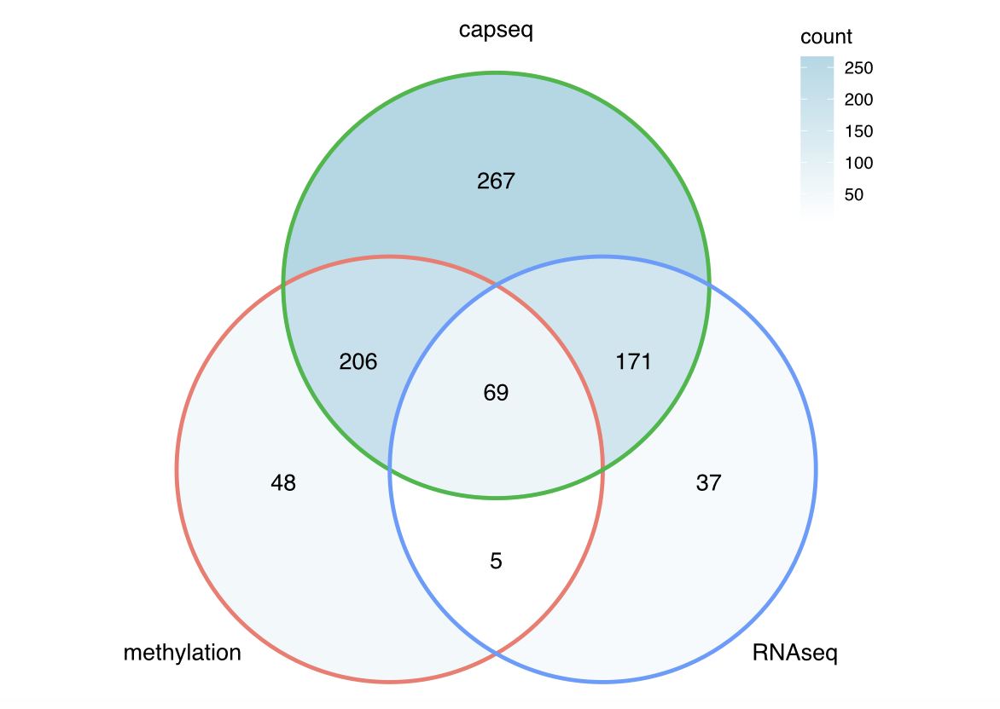

# Follicular Lymphoma Multiomics Project (FLOMICS) - integrating data from targeted DNA sequencing, methylome profiling, bulk RNAseq and single nuclei RNAseq to discover new subtypes

Molecular classification or subtyping of cancers is becoming an essential step toward clinical practice of precision medicine. In follicular lymphoma (FL), molecular classification or subtyping has emerged as a major unmet need. This project focuses on the analysis of multi-omics data to subclassify FL. The project aims to study gene mutations, the transcriptome and the methylome of FL, to rigorously define and validate molecular subtypes by unravelling inter- and intra-patient heterogeneity. Our hypothesis is that FL is not just one disease, but that it can be classified into biologically distinct subgroups.

## Patient cohorts

We adopted an inclusive approach, aiming to enrol primary FL patient samples from both population-based cohorts and from clinical trial series, and from patients with diverse clinical presentations. Overall, we included 4 cohorts:
1. A retrospective, multicentre cohort of patients presenting with limited-stage disease and treated with radiation or with advanced-stage disease, and treated with immunochemotherapy, accrued from Toronto, Montreal, Kingston, Aarhus, Oslo and Brisbane (referred to as “retrospective” cohort);
2. A retrospective cohort of existing data from a previously published study in which treatments were heterogeneous (referred to as “PLOSMED” cohort);
3. The E2408 trial, a randomized phase II trial in which patients were treated with bendamustine and rituximab, with or without bortezomib, followed by maintenance with rituximab, with or without lenalidomide;
4. The E4402 trial, a randomized phase III trial in which patients with low-tumor burden FL were treated with single-agent rituximab, followed by rituximab maintenance or re-treatment, as needed.

## Sample overview

All samples included, post QC, are shown below, as of 21 Mar 2023:

### Methylome: DNA methylation EPIC Microarray Data Analysis

In February 2019, DNA methylation data for another 147 patients using Illumina MethylationEpic BeadChip were received. The breakdown of these samples were as follows:
- 10 diffuse large B-cell lymphoma (DLBCL) = “aggressive” control
- 5 reactive lymph node (RLN) = “normal” control
- 132 FL = cases
With the 30 FL samples from pilot dataset, a total of 177 samples and 162 FL cases. Of these, only 170 were used for downstream analysis based on QC. Copy number data was derived for 165 of these samples (170 - 5 RLN “normal” controls).

#### Main Scripts

- Preprocessing/QC [[Code]](https://github.com/kridel-lab/FLOMICS/blob/master/Code/Analysis/Methylation/1_QCRemoveSamples.R)
- Differential methylation via probes [[Code]](https://github.com/kridel-lab/FLOMICS/blob/master/Code/Analysis/Methylation/7_DifferentialMethylation.R)
- Differential methyaltion via regions [[Code]](https://github.com/kridel-lab/FLOMICS/blob/master/Code/Analysis/Methylation/9_DifferentiallyMethylatedRegions.R)
- Differential variability via probes [[Code]](https://github.com/kridel-lab/FLOMICS/blob/master/Code/Analysis/Methylation/8_DifferentialVariability.R)
- Tumor purity [[Code]](https://github.com/kridel-lab/FLOMICS/blob/master/Code/Analysis/Methylation/24_Tumor_purity_check.R)
- Clustering via Kmeans, Medoids, Hierarchical, RPMM and InfiniumClust [[Code]](https://github.com/kridel-lab/FLOMICS/blob/master/Code/Analysis/Methylation/14_Clustering_Kmeans_Medoids_Hierarchical_RPMM_InfiniumClust.R)
- tSNE [[Code]](https://github.com/kridel-lab/FLOMICS/blob/master/Code/Analysis/Methylation/13_tSNEPlot.R)
- Estimate cell counts [[Code]](https://github.com/kridel-lab/FLOMICS/blob/master/Code/Analysis/Methylation/12_EstimateCellCountsMethylation.R)
- Other scripts [[Code]](https://github.com/kridel-lab/FLOMICS/tree/master/Code/Analysis/Methylation)

### Transcriptome: RNA-seq Data Analysis

In February 2020, RNAseq data for 136 samples were obtained. After removing T2 samples (3) and an unmatching sample with methyaltion data (1), 132 samples were available.  The breakdown of these samples were as follows:
- 10 diffuse large B-cell lymphoma (DLBCL) = “aggressive” control
- 1 reactive lymph node (RLN) = “normal” control
- 121 FL = cases

OICR returned 19 samples that passed their QC criteria in June 2022
- 19 FL samples returned 

E4402 samples that were sequenced at BC Cancer in 2017 were also included in the 2022 uniform QC analyses
- 210 FL samples 

#### RNA-seq workflow

#### Main QC steps

- Screen for rRNA contamination 
- Calculate the percentage of aligned coding bases 
- Running qualimap bamqc to calculate the insert size 
- Collect the STAR log files 

Tier2: 290 sample passed
rrna_contam_perct<=35 &&
picard_RnaMetrics_perct>=5 (PF_BASES/PF_ BASES)

#### RNAseq data processing

- Pre-processing: merging or renaming the samples (TGL 136, OICR 19, E4402 210); remove adapters and low-quality bases (trimmomatic-0.39) [[Code]](RNAseq/)
- mapping: mapping against the reference genome GRCh37 – STAR/2.7.9a (Spliced Transcripts Alignment to a Reference), which is a splice-aware alignment tool with two-step process: [[Code]](RNAseq/)

  - create a genome index (consistent with the software version)
human genome build- “GRCh37.primary_assembly.genome.fa”
annotation file  - “gencode.v37lift37.annotation.gtf”

  - map reads to the genome
[[Code]](RNAseq/)
STAR_log files per sample were collected as well to evaluate the mapping quality
- counting: using the resulting BAM files as input to htseq-count/0.11.0 to obtain the raw counts per gene per sample, then merging per-sample read counts into the final expression matrix [[Code]](RNAseq/)

#### investigate and adjust the Batch-effect:
- BactchQC was used to investigate the batch effect: In order to run BatchQC, we created two files:
  - A gene by sample matrix with gene IDs in the first column and sample IDs as column headers. The cells contain quantile normalized expression values.
  - A metadata file with sample IDs in the first column and information about the samples in the remainder It should include the suspected batch variables, such as Sequencing Platform, Data, Biopsy Site, etc., as well as your classifier (e.g. tumor type).
- ComBat-seq was used to adjust the batch effect: it took an untransformed raw count matrix and a known batch variable as input
- filter out the low-exp genes (optional): filterByExpr function from edgeR can automatically filter low exps genes

### Genome: Targeted DNAseq Data Analysis

Data for 803 FFPE samples were submitted for hybridization-based capture sequencing (271 from mutilcentre, 98 from E2408, 246 from BCCA/PLOSMED, 188 FROM E4402). Final raw data were obtained in November 2021. Of these, 713 samples (203 from multicenre, 83 from E2408, 242 from BCCA/PLOSMED, 185 from E4402) were used for downstream analysis based on QC.
- diffuse large B-cell lymphoma (DLBCL) = “aggressive” control
- reactive lymph node (RLN) = “normal” control
- follicular lymphoma (FL) = cases

#### Scripts
- Workflow outline and script descriptions can be found [[here]](DNAseq/README.md)

### Immune deconvolution
- Seurat analysis using snRNAseq data [[Code]](Code/BioinformaticsProcessing/snRNAseq/)
- Bisque analysis using seurat clusters and bulk rna-seq count matrix [[Code]](Code/Analysis/snRNAseq/)
- Plotting estimated immune fractions [[Code]](Code/Analysis/RNAseq/RNAseq-immune-deconvolution-bisque.R)
- Estimated immune fractions versus mutation status [[Code]](Code/Analysis/RNAseq/RNAseq-immune-deconvolution-mutation-correlation-summary-results.R)

