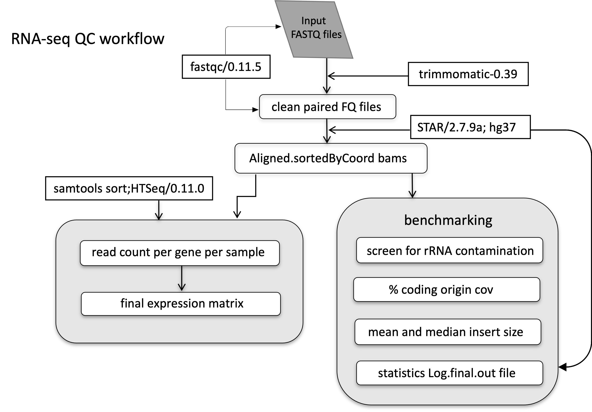

### Transcriptome: RNA-seq Data Analysis

In February 2020, RNAseq data for 136 samples were obtained. After removing T2 samples (3) and an unmatching sample with methyaltion data (1), 132 samples were available.  The breakdown of these samples were as follows:
- 10 diffuse large B-cell lymphoma (DLBCL) = “aggressive” control
- 1 reactive lymph node (RLN) = “normal” control
- 121 FL = cases

OICR returned 19 samples that passed their QC criteria in June 2022
- 19 FL samples returned

E4402 samples that were sequenced at BC Cancer in 2017 were also included in the 2022 uniform QC analyses
- 210 FL samples

#### RNA-seq workflow

#### Main QC steps

- Screen for rRNA contamination
- Calculate the percentage of aligned coding bases
- Running qualimap bamqc to calculate the insert size
- Collect the STAR log files

Tier2: 290 sample passed
rrna_contam_perct<=35 &&
picard_RnaMetrics_perct>=5 (PF_BASES/PF_ BASES)

#### RNAseq data processing

- Pre-processing: merging or renaming the samples (TGL 136, OICR 19, E4402 210); remove adapters and low-quality bases (trimmomatic-0.39) [[Code]](001_trimmomatic-0.39-2_conda_QC_parallel.sh)
- mapping: mapping against the reference genome GRCh37 – STAR/2.7.9a (Spliced Transcripts Alignment to a Reference), which is a splice-aware alignment tool with two-step process: 

  - create a genome index (consistent with the software version)
human genome build- “GRCh37.primary_assembly.genome.fa”
annotation file  - “gencode.v37lift37.annotation.gtf”

  - map reads to the genome
[[Code]](002_STAR_parallel_sbatch_v37.sh)
STAR_log files per sample were collected as well to evaluate the mapping quality
- counting: using the resulting BAM files as input to htseq-count/0.11.0 to obtain the raw counts per gene per sample, then merging per-sample read counts into the final expression matrix [[Code]](003_htseq_parallel_sbatch_v3_grch37.sh)

#### investigate and adjust the Batch-effect:
- BactchQC was used to investigate the batch effect: In order to run BatchQC, we created two files:
  - A gene by sample matrix with gene IDs in the first column and sample IDs as column headers. The cells contain quantile normalized expression values.
  - A metadata file with sample IDs in the first column and information about the samples in the remainder It should include the suspected batch variables, such as Sequencing Platform, Data, Biopsy Site, etc., as well as your classifier (e.g. tumor type).
- ComBat-seq was used to adjust the batch effect: it took an untransformed raw count matrix and a known batch variable as input
- filter out the low-exp genes (optional): filterByExpr function from edgeR can automatically filter low exps genes
